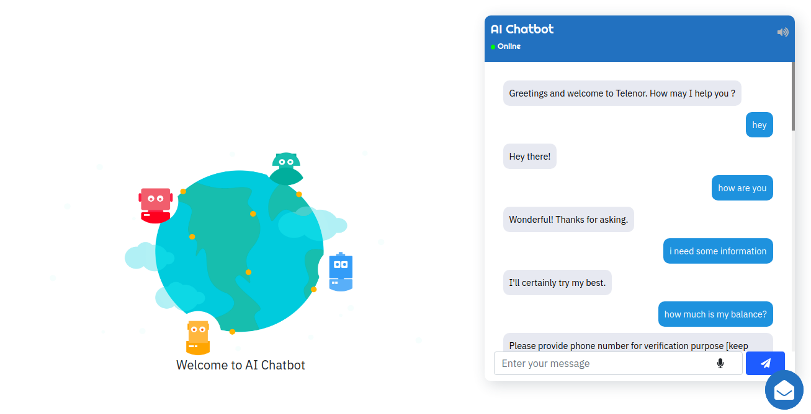
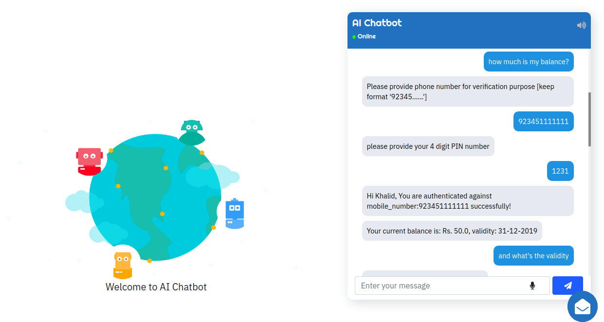
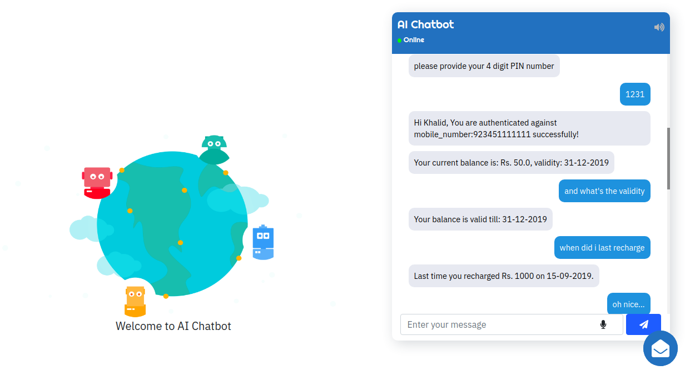
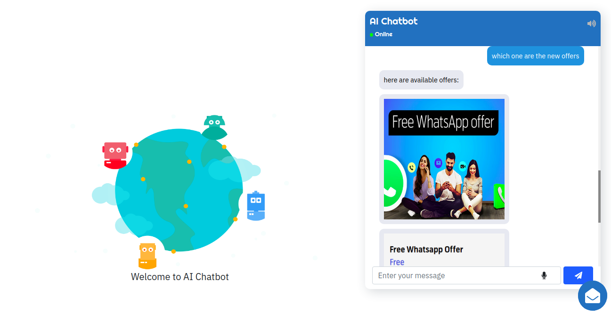
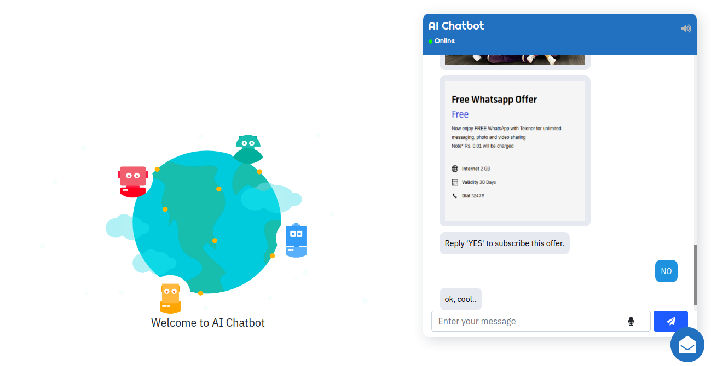

# TP_Chatbot_Rasa
---
---
## Product Screenshots

<div class="w3-content w3-display-container">
    
    
    
    
    
</div>


## Current Architecture & Features Implemented

**Architeture:** 

For Roman-Urdu & English, two separate agents are trained, evaluated and tested. Each having its own trainin samples, but same intent_names, actions & domain

**Features**
- **Spell Checker** is implemented to correct only delibrate misspelled word through skipping vowels from original words. example ('balance': 'blnc', 'balanc', 'blnce')
- **Language Detection** is done through an ensemble of custom trained model and Fasttext language     detection model.
- **Parsers** are written to convert text formats to JSON and back to text, for support of UI based drag-n-drop features.  
    1- Intnet Parser
    2- Stories Parser
    3- Domain Parser (json to yml is pending)
- **User Authenticatoin**, users are verified based on PIN codes as of now
- **Small Talk**, a limited version of small talk is implemented (for both roman & english agents) alongwith other intents
- **Logs**, every conversation is being logged (separate file for each session-ID)
- **Low Confidence Prompts** are implemented using rasa's two stage fallback policy
- **UI** is currently implemented on LiveZilla (on Evamp & Sanga servers)
- **Backend** is deployed on redbuffer servers.

---
## Future Work
- Integration of Parsers with UI
- FAQs Knowledge Base 
- Personalized Content
- Business Logic Prompts
- Low Confidence Prompt needs to be improved using some custom mechanism. Rasa's two stage fallback policy sovles this problem but causes a lot others too.
- One-Click integration modules for different platforms: Slack, Messenger, WhatApp etc.
- **Admin Portal** with support of self-learning chatbot system
---
### Git Repositories
[Project Directory](https://gitlab.com/redbuffer/tp_chatbot_rasa)

There are 3 branches for project right now. 
    1- **Master** is holding the code version that is being used in live demo
    2- **Development** other than live demo, latest stable code will be pushed here. 
    3- **Dev2** all the tests can be conducted on this branch. OR incase multiple developers are working on project.


### Instructions for Demo 
- Only phone numbers are allowed currently:
    - 923441111111
    - 923451234567
- Enter any 4-digit PIN number
- Enter '/restart' to restart the session
- For now page reload will also reset server sessions (will clear chat history)
---
---
### Installation with Docker
```sh
$ sudo apt-get update -y

$ sudo apt-get install docker.io
```
```sh
$ sudo curl -L https://github.com/docker/compose/releases/download/1.21.2/docker-compose-`uname -s`-`uname -m` -o /usr/local/bin/docker-compose
```

```sh
$ sudo chmod +x /usr/local/bin/docker-compose

$ cd base_docker; 

$ bash ./base_docker.sh

$ cd ..

$ bash ./run.sh
```
**This installation is only for backend of Chatbot system.**

---
---
### Installation with Virtual Environment

**This installation is only for backend of Chatbot system.**

Setup Virtual Environment (Linux Environment):

- Make new python3 environent & activate:
```sh
$ virtualenv --python=python3 venv
$ source venv/bin/activate
```

- and install requirements from 'requirements.txt' file:
```sh
pip install -r requirements.txt
```

Your environment should be ready by now :smiley: !

#### Setup -- RASA Server

1) Clone Project & open terminal in chatbot root directory 'tp_chatbot_rasa'
2) activate virtual environment
    > source venv/bin/activate

3) run commands for RASA Action server:
    > rasa run actions --port 5005
4) open a new terminal window
5) activate the virtual environment by 2
6) run commands for RASA API server
    > rasa run -m models/ --enable-api --log-file out.log --cors "*" --endpoints endpoints.yml --port 8000 --debug

#### Setup  -- Flask API Server
1) open new terminal / linux screen in root directory
2) activate virtual environment
3) run flask api:
    > python3 api.py

#### Client Side
1) open 'index.html' in browser 


---
##### Other Information about Server PORTS:
Setup and Port Numbers for Multi-Lingual Chatbot
Redis Tracker Store: 6379
tracker_store:
type: redis
url: localhost
port: 6379
db: 0
password:

Redis Interface: redis-commander (at port 8081)

Roman Urdu chat agent:
    actions server:   
    >> rasa run actions -p 5056
    
    shell/api server to listen action server:
    (define action endpoint in endpoints.yml)
    >> rasa shell --endpoints endpoints.yml -p 5006 --debug


English chat agent:
    actions server:   
    >> rasa run actions -p 5055
    
    shell/api server to listen action server:
    (define action endpoint in endpoints.yml)
    >> rasa shell --endpoints endpoints.yml -p 5005 --debug
~~~

>> todo: update docker file for single run, update readme for local UI, dockerized version is a bit slower, 
	clean readme, add directory structure, test cases for complete chatbot system
